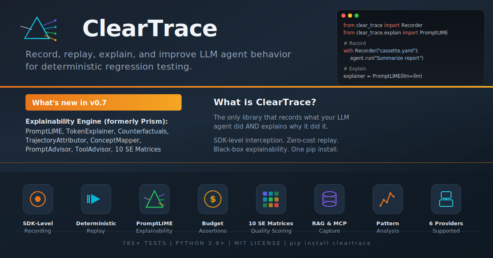

<p align="center">
  
</p>

<p align="center">
  <strong>Record, replay, explain, and improve LLM agent behavior.</strong><br/>
  Deterministic testing + black-box explainability in one library.
</p>

<p align="center">
  <a href="https://pypi.org/project/cleartrace/"></a>
  <a href="https://pypi.org/project/cleartrace/"></a>
  <a href="https://opensource.org/licenses/MIT"></a>
  <a href="https://github.com/ioteverythin/TraceOps"></a>
</p>

---

ClearTrace intercepts LLM calls at the **SDK level** - not HTTP - capturing every call, tool use, and agent decision into YAML cassettes. Replay them deterministically with zero API calls. Then **explain** why your agent behaved the way it did, **score** your prompts and tools against 10 SE quality matrices, and **guard** against regressions in CI.

```
    YOUR AGENT
        |
    [ RECORD ]  ──→  cassette.yaml  ──→  [ REPLAY ]     zero cost, 100ms
        |                                      |
    [ EXPLAIN ]  ──→  why did it do that?      |
        |                                      |
    [ ADVISE ]   ──→  improve prompts/tools    |
        |                                      |
    [ GUARD ]    ──→  catch regressions   ←────┘      pytest-native
```

## Install

```bash
pip install cleartrace                    # Core: record, replay, diff, assert
pip install cleartrace[explain]           # + Explainability engine (LIME, counterfactuals, advisors)
pip install cleartrace[openai]            # + OpenAI auto-intercept
pip install cleartrace[anthropic]         # + Anthropic auto-intercept
pip install cleartrace[langchain]         # + LangChain
pip install cleartrace[langgraph]         # + LangGraph
pip install cleartrace[crewai]            # + CrewAI
pip install cleartrace[charts]            # + Matplotlib heatmaps
pip install cleartrace[word]              # + Word document reports
pip install cleartrace[all]               # Everything
```

---

## Record

Wrap any LLM code. Every call is captured - provider, model, messages, response, tool calls, tokens, cost, timing.

```python
from clear_trace import Recorder

with Recorder(save_to="cassettes/test.yaml") as rec:
    response = client.chat.completions.create(
        model="gpt-4o",
        messages=[{"role": "user", "content": "What is 2+2?"}],
    )

print(f"Recorded {rec.trace.total_llm_calls} calls, ${rec.trace.total_cost_usd:.4f}")
```

Works with async, streaming, and 6 providers out of the box:

```python
# Async
async with Recorder(save_to="cassettes/async.yaml"):
    response = await client.chat.completions.create(...)

# Streaming - assembled automatically, replayed as realistic chunks
with Recorder(save_to="cassettes/stream.yaml"):
    for chunk in client.chat.completions.create(..., stream=True):
        print(chunk.choices[0].delta.content or "", end="")

# LangGraph
with Recorder(save_to="cassettes/graph.yaml", intercept_langgraph=True):
    result = graph.invoke({"messages": [HumanMessage(content="...")]})

# LangChain
with Recorder(save_to="cassettes/agent.yaml", intercept_langchain=True):
    result = agent.invoke({"input": "your question"})

# CrewAI
with Recorder(save_to="cassettes/crew.yaml", intercept_crewai=True):
    result = crew.kickoff(inputs={"topic": "AI trends"})
```

## Replay

Same code, zero API calls, millisecond execution, fully deterministic.

```python
from clear_trace import Replayer

with Replayer("cassettes/test.yaml"):
    response = client.chat.completions.create(
        model="gpt-4o",
        messages=[{"role": "user", "content": "What is 2+2?"}],
    )
    assert response.choices[0].message.content  # deterministic
```

### pytest plugin - zero config

```python
def test_agent(cassette):
    agent.run("Summarize the quarterly report")
```

```bash
pytest --record              # Record cassettes
pytest                       # Replay (default)
pytest --record-mode=auto    # Record if missing, replay if exists
```

Budget markers:

```python
@pytest.mark.budget(max_usd=0.50, max_tokens=10_000, max_llm_calls=5)
def test_agent(cassette):
    agent.run("Summarize the report")
```

---

## Explain

**Why did the LLM say that? Why did the agent pick that tool?**

The explain engine brings LIME/SHAP-style interpretability to LLM agents - but works with **any API** (no model weights needed).

### Prompt LIME - which sentences drive the output?

```python
from clear_trace.explain import PromptLIME, LLMClient

llm = LLMClient(call_fn=my_llm_function)
explainer = PromptLIME(llm=llm, n_samples=50)
explanation = explainer.explain(
    prompt="You are a Python expert. Be concise. Explain decorators.",
    output="Decorators are functions that modify other functions..."
)

for s in explanation.top_sentences(3):
    print(f"{s.score:+.3f}  {s.text}")
# +0.850  "Explain decorators."
# +0.420  "You are a Python expert."
# +0.110  "Be concise."
```

### Token importance - leave-one-out analysis

```python
from clear_trace.explain import TokenExplainer

explainer = TokenExplainer(llm=llm)
explanation = explainer.explain("What is machine learning?")

for t in explanation.top_tokens(3):
    print(f"{t.score:+.3f}  '{t.token}'")
# +1.000  'learning'
# +0.780  'machine'
```

### Counterfactuals - smallest change that flips the output

```python
from clear_trace.explain import CounterfactualGenerator

gen = CounterfactualGenerator(llm=llm)
explanation = gen.explain("You are a helpful assistant. Always be polite.", output="Of course!...")

for cf in explanation.flipped_counterfactuals():
    print(f"Change: {cf.change_description}")
    print(f"  Output became: {cf.modified_output[:80]}")
```

### Trajectory attribution - why the agent chose each tool

```python
from clear_trace.explain import TrajectoryAttributor

attributor = TrajectoryAttributor(llm=llm, available_tools=["search", "read_file", "write_file"])
explanation = attributor.explain_trajectory([
    {"tool": "search",     "context": "User asked to find bugs in auth module"},
    {"tool": "read_file",  "context": "Search returned auth.py as relevant"},
    {"tool": "write_file", "context": "Found null check bug, need to fix it"},
])

for d in explanation.to_explanation().trajectory.get_critical_decisions():
    print(f"Step {d.step}: {d.tool_name} (confidence: {d.confidence:.2f})")
```

### Concept mapping - map behavior to human concepts

```python
from clear_trace.explain import ConceptExtractor

extractor = ConceptExtractor()
concepts = extractor.extract("You are an expert. Please explain step by step.")
for c in concepts:
    print(f"{c.concept}: {c.score:.2f}")
# chain_of_thought: 0.33
# expertise_level: 0.20
```

### ClearTrace bridge - explain recorded traces

```python
from clear_trace.explain.trajectory import load_cleartrace_cassette, cassette_to_decisions

cassette = load_cleartrace_cassette("cassettes/agent_run.yaml")
decisions = cassette_to_decisions(cassette)
explanation = attributor.explain_trajectory(decisions)
```

---

## Advise

Score prompts and tools against **10 software engineering quality matrices**, then generate surgical improvements.

### Prompt Advisor

```python
from clear_trace.explain import PromptAdvisor, LLMClient

advisor = PromptAdvisor(llm=LLMClient(call_fn=my_fn))
report = advisor.analyze(
    prompt="You are a helpful assistant. Answer questions about our product.",
    context="Customer support chatbot for a SaaS product"
)

print(f"Score: {report.overall_score:.0%}")

for s in report.suggestions:
    print(f"[{s.severity}] {s.category}: {s.title}")

# Get improved prompt (surgical section-aware edits, not just appended text)
improved = advisor.improve(report)
```

### Tool Advisor

```python
from clear_trace.explain import ToolAdvisor, ToolDefinition

tools = [
    ToolDefinition(name="search_products", description="Search catalog",
                   parameters={"query": {"type": "string"}}),
]

advisor = ToolAdvisor(llm=llm)
report = advisor.analyze(prompt="You are a support agent.", tools=tools)
print(f"Tool score: {report.tool_report.overall_score:.0%}")
```

### 10 SE Quality Matrices

| Prompt Matrices | Tool Matrices |
|---|---|
| **PCAM** - Prompt Completeness & Adequacy | **TSQM** - Tool Schema Quality |
| **SRM** - Structural Robustness | **PTAM** - Parameter & Type Adequacy |
| **RGAM** - Response Guidance & Alignment | **TCAM** - Tool Coverage & Accessibility |
| **CAR** - Compliance & Auditability | **JCM** - JSON Compliance |
| **BAVM** - Behavioral Accuracy & Validation | **CAR** - Compliance & Auditability |

---

## Guard

### Budget assertions

```python
from clear_trace import assert_cost_under, assert_tokens_under, assert_max_llm_calls, assert_no_loops

def test_agent_budget():
    with Recorder() as rec:
        agent.run("Summarize the report")

    assert_cost_under(rec.trace, max_usd=0.50)
    assert_tokens_under(rec.trace, max_tokens=10_000)
    assert_max_llm_calls(rec.trace, max_calls=5)
    assert_no_loops(rec.trace, max_consecutive_same_tool=3)
```

### Trace diffing

```python
from clear_trace import diff_traces, load_cassette

old = load_cassette("cassettes/v1.yaml")
new = load_cassette("cassettes/v2.yaml")
diff = diff_traces(old, new)
print(diff.summary())
# TRAJECTORY CHANGED
#   Old: llm_call:gpt-4o -> tool:search -> llm_call:gpt-4o
#   New: llm_call:gpt-4o -> tool:browse -> tool:search -> llm_call:gpt-4o
```

### Semantic regression detection

```python
from clear_trace.semantic import assert_semantic_similarity

assert_semantic_similarity(old_trace, new_trace, threshold=0.85)
```

### RAG assertions

```python
from clear_trace.rag import assert_chunk_count, assert_min_relevance_score, assert_no_retrieval_drift

assert_chunk_count(rec.trace, min_chunks=3)
assert_min_relevance_score(rec.trace, min_score=0.75)
assert_no_retrieval_drift(old_trace, rec.trace, tolerance=0.1)
```

---

## Analyze

Behavioral analysis across cassette libraries, inspired by [agent-pr-replay](https://github.com/sshh12/agent-pr-replay).

```python
from clear_trace import PatternDetector, GapAnalyzer, SkillsGenerator

# Discover patterns
report = PatternDetector(window_size=3).analyze_dir("cassettes/")
# Analyzed 47 traces | Avg: 3.2 LLM calls, 1,450 tokens, $0.012/run

# Compare against golden baselines
gap_report = GapAnalyzer().compare(golden_traces, agent_traces)
# [CRITICAL] Agent uses 4.2x more tokens than golden baseline
# exits code 1 if critical gaps - CI-friendly

# Auto-generate steering documents
SkillsGenerator().from_gap_report(gap_report, output_path="AGENTS.md")
```

---

## CLI

```bash
cleartrace inspect cassettes/test.yaml          # Detailed trace info
cleartrace diff old.yaml new.yaml               # Compare two traces
cleartrace debug cassettes/test.yaml            # Time-travel debugger
cleartrace report cassettes/test.yaml -o r.html # HTML report
cleartrace costs cassettes/                     # Aggregate spend
cleartrace analyze cassettes/ --skills AGENTS.md # Behavioral analysis
cleartrace gap-report golden/ runs/             # Gap analysis (CI-friendly)
cleartrace prune cassettes/ --older-than 30d    # Cleanup
```

---

## Reports

5 output formats:

| Format | Module | Use case |
|---|---|---|
| **Console** | `ConsoleReport` | Quick terminal inspection |
| **HTML** | `HTMLReport`, `generate_html_report` | Shareable interactive reports |
| **Word** | `WordReport` | Formal docs with diff highlighting |
| **Heatmaps** | `MatrixPlotter` | SE matrix visualization |
| **Advisor** | `AdvisorReport` | Prompt/tool quality summaries |

---

## Providers

| Provider | Auto-intercepted | Sync | Async | Streaming |
|----------|:---:|:---:|:---:|:---:|
| OpenAI | yes | yes | yes | yes |
| Anthropic | yes | yes | yes | yes |
| LiteLLM | yes | yes | yes | yes |
| LangChain | yes | yes | yes | - |
| LangGraph | yes | yes | yes | yes |
| CrewAI | yes | yes | yes | - |

---

## Architecture

See [ARCHITECTURE.md](ARCHITECTURE.md) for the full system design - the periodic table of modules, geological stack diagram, and complete file map.

```
src/clear_trace/
├── recorder.py          Record
├── replayer.py          Replay
├── diff.py              Diff
├── assertions.py        Guard
├── analysis/            Analyze (patterns, gaps, skills)
├── interceptors/        LangChain, LangGraph, CrewAI
├── rag/                 RAG recording + scoring
├── mcp/                 MCP tool recording
├── semantic/            Semantic regression
├── reporters/           HTML, terminal, cost dashboard
├── export/              Fine-tune JSONL
├── github/              PR fetching
└── explain/             Explainability engine
    ├── perturbation/      PromptLIME, TokenExplainer
    ├── counterfactual/    CounterfactualGenerator
    ├── trajectory/        TrajectoryAttributor
    ├── concepts/          ConceptExtractor, ConceptMapper
    ├── reasoning/         ReasoningEngine
    ├── advisor/           PromptAdvisor, ToolAdvisor, 10 SE matrices
    └── visualization/     HTML, console, Word, heatmaps
```

---

## Version History

| Version | Highlights |
|---------|-----------|
| **v0.1** | Record/replay, pytest plugin, YAML cassettes |
| **v0.2** | Async + streaming, budget assertions, time-travel debugger, HTML reports |
| **v0.3** | LangChain, LangGraph, CrewAI interceptors |
| **v0.4** | Cost dashboard, enhanced diff, auto-record mode |
| **v0.5** | RAG recording + scoring, semantic regression, MCP, fine-tune export |
| **v0.6** | Behavioral analysis, GitHub PR integration |
| **v0.7** | **Explainability engine** - PromptLIME, TokenExplainer, CounterfactualGenerator, TrajectoryAttributor, ConceptMapper, ReasoningEngine, PromptAdvisor, ToolAdvisor, 10 SE matrices, Word/heatmap reports |

---

## License

MIT - see [LICENSE](LICENSE).

Copyright (c) 2026 Joshua
